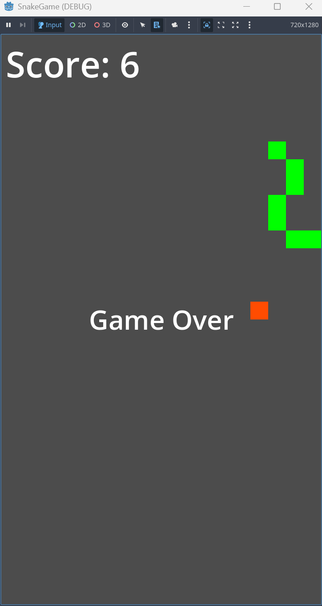

# AdvSnakeGame 🐍

A simple yet unique Snake game built with Godot 4.  
Unlike the classic snake, this snake rotates automatically and players can tap to change the direction to counterclockwise.

## 🎮 How to Play

- The snake rotates **clockwise automatically**.
- **Tap / Click and hold** to make the snake rotate **counterclockwise**.
- Eat the red food blocks to grow your snake and increase score.
- Avoid hitting the wall or yourself → it will end the game.
- After game over → tap screen to restart the game.

## 🚀 Features

- Auto-rotating snake logic
- 8-direction movement for smooth circle turning
- Food spawns randomly avoiding edges and snake body
- Score and Game Over UI
- Portrait Mode → works perfectly on mobile
- Tap to restart game after Game Over

## 📱 Mobile friendly

This game is designed for portrait screen (vertical) and touch input → perfect for Android phones and tablets.

## 💾 How to Run

1. Clone the repository
2. Open with Godot 4
3. Press ▶️ Play to test, or Export to EXE / APK to play on PC or Android

## 📌 Credits

- Developed by xuzhihuiCSY
- Made with Godot Engine 4
